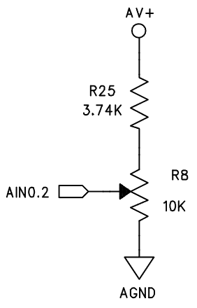
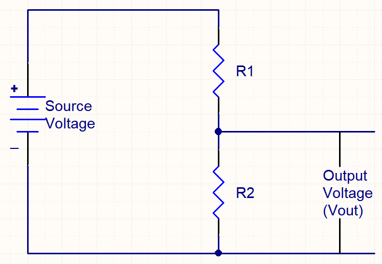

## ADC on ToolStick-UniDC-UG

  The schematic of on-board adjustable voltage-divider circuit is shown on Brightspace Lab 1 - ToolStick-UniDC-UG, as below:

  The voltage divider can be simplify as below: 

  Here is the equation:

Vout$\frac{Vs * R2}{R1 + R2}$

